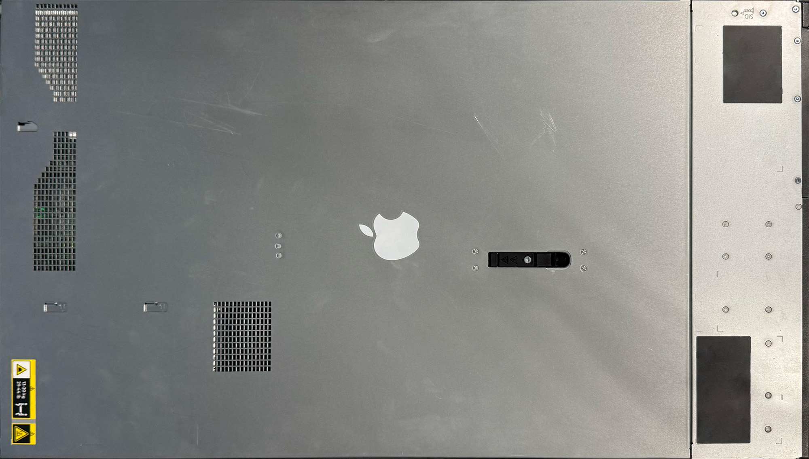
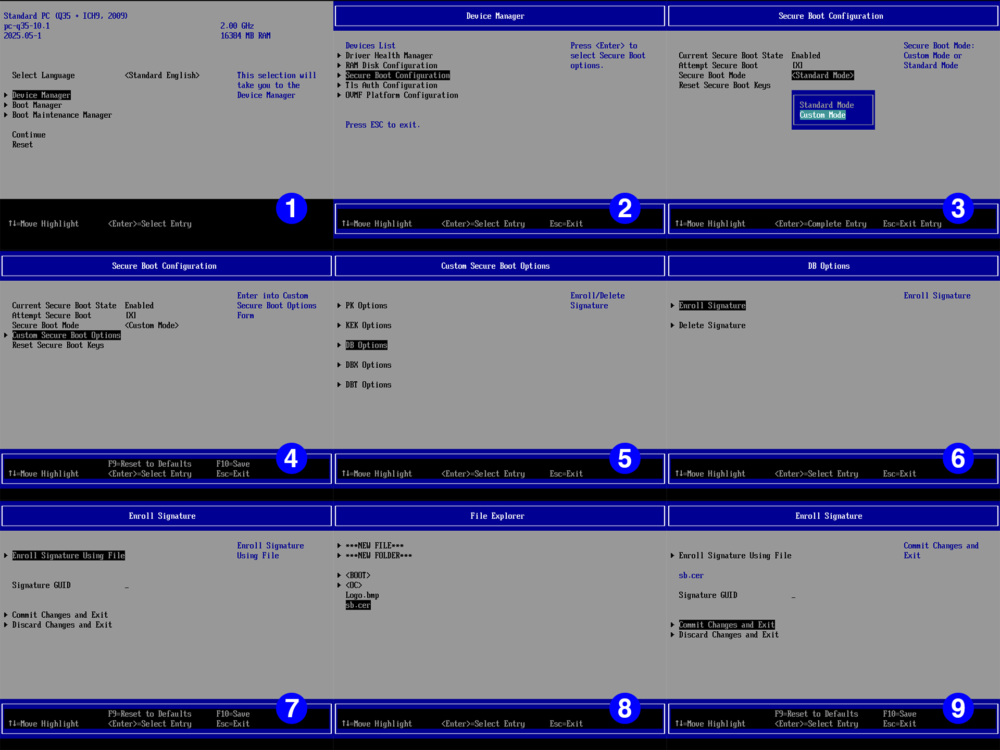
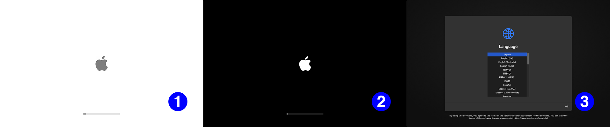
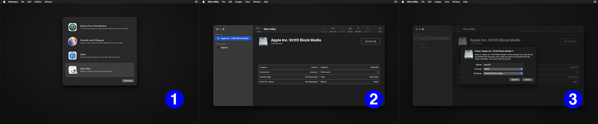
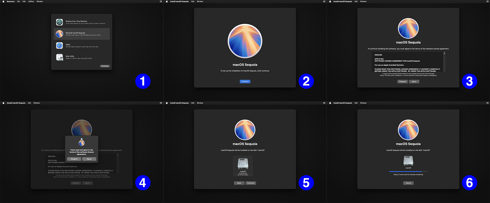
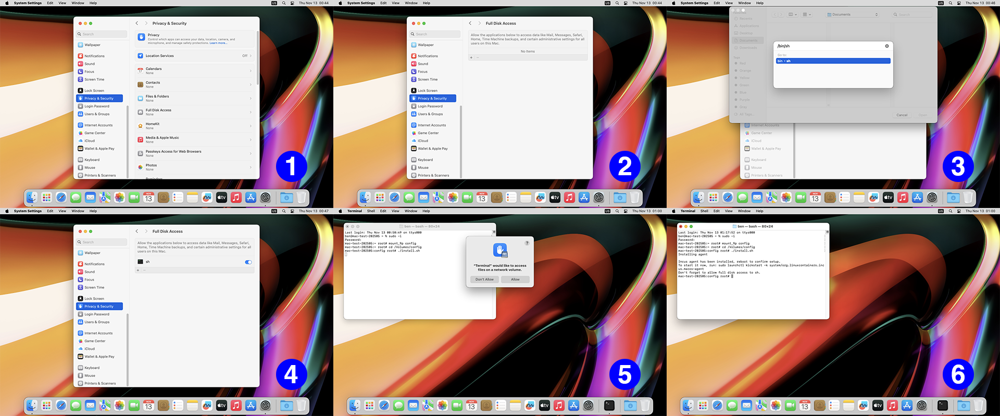
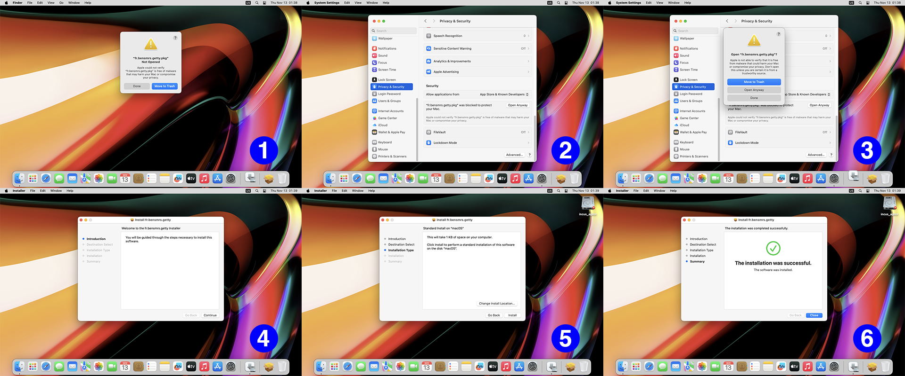

# macOS on Incus

This guide details the necessary steps to get macOS up and running on Incus, through the [**macOS on Incus**](https://github.com/macOS-on-Incus) project.

**macOS on Incus** intends to provide a minimalistic (as in no unnecessary bits) way to run macOS on an as-vanilla-as-possible installation of Incus. It strives to stay as compliant as possible with regulations and license agreements, by not directly distributing any non-free IP, and only providing free software.

## Hardware

Unlike Linux virtualization, macOS virtualization requires a specific hardware configuration to run properly on x86. While this guide provides no support for non-Intel processors, contributions for AMD processors are welcome as long as they respect the project’s minimalistic spirit.

Pursuant to the software license agreement for macOS, you are only allowed to run macOS on an Apple-branded computer, and on it, to run up to two additional instances of macOS. Make sure you fully understand the implications of not complying with these conditions, should you decide not to.

You can easily recognize such hardware by the famous Apple logo. For reference, here is a genuine (at least the sticker is) Apple ProLiant DL360 Gen10 Plus:



Note that this guide also works for other machines, such as the Apple PowerEdge R730, on which is also has been tested.

Should your CPU not be working properly with the **macOS on Incus** project, feel free to open an issue [on GitHub](https://github.com/macOS-on-Incus/orchard/issues), but keep in mind that most of the investigation will have to be done by you.

## Incus

The **macOS on Incus** project can run on any recent Incus installation, although we recommend always using the latest stable release, as new features will bring enhanced support, which this guide will later assume as it gets updated.

For macOS to work on Incus, a QEMU scriptlet is required to perform all kinds of low-level operations. For more details, you can have a look at the [Technical details](#technical-details) section.

Given a project `macos`, the QEMU scriptlet can be set this way:

```bash
curl https://raw.githubusercontent.com/macOS-on-Incus/QEMU-Scriptlet/refs/heads/main/scriptlet.py | incus profile set macos raw.qemu.scriptlet -
```

The same operation can be done on any singular instance, should you prefer not to use a profile.

## EDK2

**macOS on Incus** does not work with an EDK2 version greater than 202505. Unfortunately, most modern distributions of Incus now package version 202508 of EDK2. As long as there is no upstream support for EDK2 202508 in [OpenCore](https://github.com/acidanthera/OpenCorePkg), the project on which **macOS on Incus** is built, you will have to downgrade your EDK2 installation. On a Debian installation using Zabbly’s Incus packages, it is a matter of:

```bash
sudo apt install ovmf
sudo cp /usr/share/OVMF/OVMF_CODE_4M.secboot.fd /opt/incus/share/qemu/OVMF_CODE.4MB.fd
sudo cp /usr/share/OVMF/OVMF_VARS_4M.fd /opt/incus/share/qemu/OVMF_VARS.4MB.fd
sudo cp /usr/share/OVMF/OVMF_VARS_4M.ms.fd /opt/incus/share/qemu/OVMF_VARS.4MB.ms.fd
```

## Building the installation ISO

> [!NOTE]  
> **macOS on Incus** only intends to build installation media using recoveryOS, a special OS responsible for downloading the actual installation images for macOS. This is done because downloading said installation images is notoriously hard. If you can cleanly and reproducibly integrate a tool to download them, don’t hesitate to open an issue [on GitHub](https://github.com/macOS-on-Incus/orchard/issues) for us to discuss your work.

For now, **macOS on Incus** is a source-only distribution. This means that all the tools developed and used in the project have to be compiled. We provide a dedicated tool, [Orchard](https://github.com/macOS-on-Incus/orchard), to perform all the necessary actions.

Orchard has only been tested on Debian 13 and relies on the apt package manager. If you can cleanly and reproducibly run Orchard on another distribution, don’t hesitate to open an issue [on GitHub](https://github.com/macOS-on-Incus/orchard/issues) for us to discuss your work. Issues asking to support new distributions will be closed without comment.

## 1-minute setup

```bash
git clone https://github.com/macOS-on-Incus/orchard
cd orchard
./orchard init
./orchard build
./orchard genkeys
./orchard package --sign 15.6
incus storage volume import pool macOS.iso macOS
```

This produces a `macOS.iso` file, which you can then import into incus.

## 5-minute setup

First, clone Orchard with Git and go to its directory:

```bash
git clone https://github.com/macOS-on-Incus/orchard
cd orchard
```

Prepare the development environment with the `init` action.

```bash
./orchard init
```

You can then build all the necessary files with the `build` action:

```bash
./orchard build
```

To be able to sign the EFI binaries, Orchard expects `sb.cer`, `sb.crt` and `sb.key` to be present at its root. If you don’t have these at hand, you can simply generate them:

```bash
./orchard genkeys
```

Finally, to package an installation ISO, you just have to use the `package` action. You can pass an optional `--sign` to sign the binaries, and an optional version string to download the corresponding macOS version (refer to [OpenCore](https://github.com/acidanthera/OpenCorePkg/blob/master/Utilities/macrecovery/boards.json) for the accepted versions). If no version is given, the default one suggested by OpenCore will be downloaded, except if a `com.apple.recovery.boot` directory is present at the root of Orchard, in which case its files will be used.

```bash
./orchard package --sign 15.6
```

This produces a `macOS.iso` file, which you can then import into incus.

## Installation

After Incus and EDK2 have properly been configured and the installation ISO imported, you can proceed to the actual OS installation. Do not forget to set `image.os: macOS` on your instance, or it just won’t boot.

### First start 

You should be greeted by an error telling you that your ISO cannot boot. This is normal, as you need to import the signing certificate into OVMF’s DB. We provide a copy of it in `\EFI\sb.cer` on the installation ISO:



Reboot and continue to the next step.

### Recovery installation

You should be welcomed by a gray Apple logo on a white background with a progress bar, then, after a good minute, a white apple on a black background, then the installer’s language selection screen:



You should then format your hard drive in APFS. Choose the name you want for your disk, but please don’t write `config` or `incus_agent`, as that is going to turn out very badly for you. `macOS` *is* a good name:



Then, proceed with the installation:


Do not be impatient; it is not unusual for this step to take a good hour, even on a beefy system.

### macOS configuration

Your VM should reboot about four times (once with a black background, once with a white blackground, once with a white then a black background, and finally once with a white background, then the macOS welcome screen). Proceed with your system configuration, and do not forget **not** to agree to send information to Apple. Now would be a pretty bad moment to enter your Apple ID, should you have one.

## Last steps

### Agent installation

As mentioned on [the official documentation](https://linuxcontainers.org/incus/docs/main/howto/instances_create/#on-macos), to install the agent, you have to do, as root:

```bash
mount_9p config
cd /Volumes/config
./install.sh
```

Do not forget to give `sh` full disk access (System Settings > Privacy & Security > Full Disk Access > + > `/bin/sh`):



### Text console

If you want to enable a text console for your macOS instance, you have to download an [additional tool](https://github.com/macOS-on-Incus/fr.bensmrs.getty/releases/download/v1.0.0/fr.bensmrs.getty.pkg). When first opening it, macOS will prevent you from running it, as it is very dangerous to open a stranger’s installation package. If you trust this stranger, you can tell macOS in System Settings > Privacy & Security > Open Anyway:



## Technical details

### QEMU scriptlet

macOS is not a general-purpose OS. It has been made to work on a limited set of hardware configurations, and these configurations have something in common: they do not support hot-plugging PCI devices, or even enumerating hot-plugged devices. Incus relies a lot on PCI hotplug, so we need to remap devices created by Incus before starting macOS. This is what our QEMU scriptlet does: disks are remapped to SATA drives, network cards are remapped to USB Ethernet adapters, and a lot of other useful devices are remapped to somewhere macOS can find them. This [forum post](https://discuss.linuxcontainers.org/t/incus-are-we-macos-yet/22117) gives the whole context that led to this project.

### Bootloader dance

**macOS on Incus** stands on the shoulder of giants. This project couldn’t exist without the incredible and dedicated work from the [Acidanthera](https://github.com/acidanthera) and [Dortania](https://github.com/dortania) teams. **macOS on Incus** automates the interaction with the [OpenCore](https://github.com/acidanthera/OpenCorePkg) bootloader in several ways.

On the first boot, our bootloader sideloads OpenCore with a special configuration (called the Stage-1 configuration) that tells it to load the recovery image located within the installation ISO built by Orchard. On the first reboot of the installer (and any subsequent boot if the installation drive is still there), our bootloader copies another configuration (the Stage-2 configuration) to the newly-created EFI partition, then sideloads a simple tool that ejects the installation drive, then sideloads OpenCore with the Stage-2 configuration. This little dance allows a hands-free (well, except for the interactive parts) installation of macOS on Incus, and it is, to the best of our knowledge, the only tool that automates these steps of the macOS installation process on virtualized environments.
